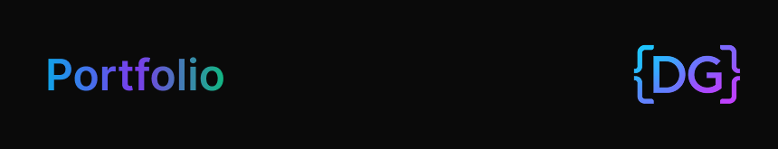

<div align="center">



# Denzell Griffith - Portfolio

</div>

A modern, minimalistic portfolio website showcasing my work as a Full Stack Software Engineer. Built with React 19, TypeScript, Vite, and TailwindCSS v4.

> [!IMPORTANT]
>
> This project is in active development. Please use the `main` branch for stable code. Other branches like `dev` and `staging` contain new features and changes that are currently being tested. If you have any suggestions or feature requests, feel free to open an issue on GitHub.

## 🎨 Design

- **Theme**: Dark futuristic minimalism with Outrun-inspired gradients
- **Colors**: Purple (#A855F7), Pink (#EC4899), Orange (#F97316)
- **Typography**: Poppins (headings) + Inter (body)
- **Effects**: Smooth animations, gradient blobs, glow effects

## 🚀 Tech Stack

- **React 19** - UI library
- **TypeScript** - Type safety
- **Vite** - Build tool
- **TailwindCSS v4** - Styling
- **Framer Motion** - Animations (optional)
- **Lucide React** - Icons (optional)

## 📦 Installation

1. **Install dependencies**:
   ```bash
   pnpm install
   ```

2. **Set up environment variables**
   ```bash
   cp .env.example .env
   ```
   Edit the `.env` file with the following variables:
   ```
   VITE_GA4_ID=your_google_analytics_id
   ```

## 🛠️ Development

Start the development server:
```bash
pnpm dev
```

The site will be available at `http://localhost:4000`

## 🏗️ Build

Build for production:
```bash
pnpm build
```

Preview production build:
```bash
pnpm preview
```

## 📁 Project Structure

```
src/
├── components/
│   ├── ui/              # Reusable UI components
│   ├── layout/          # Layout components (Navbar, Footer)
│   └── shared/          # Shared components (ProjectCard, etc.)
├── sections/            # Page sections (Hero, About, Skills, etc.)
├── data/                # Content data files
├── utils/               # Utilities and constants
└── assets/              # Static assets
```

## ✨ Features

- ✅ Fully responsive design
- ✅ Smooth scroll navigation
- ✅ Animated gradient backgrounds
- ✅ Work experience timeline
- ✅ Skills categorization
- ✅ Contact section with social links
- ✅ SEO optimized
- ✅ Accessible (WCAG compliant)
- ✅ Monitoring website traffic using Google Analytics

## 🎯 Customization

Update content in the `src/data/` directory:
- `skills.ts` - Your skills
- `experience.ts` - Work history
- `education.ts` - Education & certifications

## Author

**Denzell Griffith**

[](https://www.linkedin.com/in/denzell-griffith/)

## 📝 License

© 2025 Denzell Griffith - [MIT License](LICENSE)  
